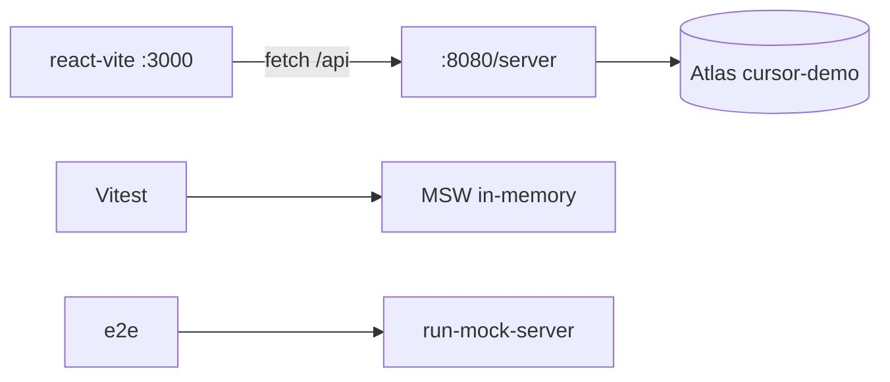

# Migrate Mock Backend to MongoDB

Convert the in-memory MSW mock (`@mswjs/data` + localStorage/json) into a real Express API backed by MongoDB Atlas. Keep the REST contract identical so the frontend only needs env changes.

**Reference implementation**: [apps/react-vite/server/](../../apps/react-vite/server/) (PR #11 pattern).

## Before coding — ask these 5 questions

Use `AskQuestion` (or ask conversationally) before designing collections:

| Decision | Default for cursor-demo |
|----------|-------------------------|
| App scope | `react-vite` only (mock is duplicated in nextjs apps) |
| Atlas target | New database `cursor-demo` on connected cluster |
| Comments model | Separate `comments` collection (paginated independently, unbounded growth) |
| Author display | Extended reference: embed `{ id, firstName, lastName, ... }` snapshot on discussions/comments |
| Auth level | Demo parity: base64 cookie token + DJB2 `hash()` from `src/testing/mocks/utils.ts` |

Read the [mongodb-schema-design](https://github.com/mongodb/docs) skill for embed-vs-reference tradeoffs.

## Git workflow

```
- [ ] git checkout master && git pull
- [ ] git checkout -b feat/mongodb-backend   # or feat/<topic>
- [ ] Implement (see checklist below)
- [ ] Commit, push, gh pr create with summary + test plan
```

Do **not** commit: `.env`, `.cursor/skills/` (unless adding this skill), `.yarn/install-state.gz`.

## Task checklist

```
Discovery
- [ ] Map entities in src/testing/mocks/db.ts (fields + relationships)
- [ ] List all handlers in src/testing/mocks/handlers/ (method, path, auth rules)
- [ ] Note response shapes in src/types/api.ts (id vs _id, author vs authorId on writes)
- [ ] Confirm runtime modes: browser MSW, run-mock-server (e2e), Vitest setupServer

Server scaffold (apps/react-vite/server/)
- [ ] env.ts — MONGODB_URI, APP_URL, APP_MOCK_API_PORT, ENABLE_DEMO_SEEDING (dotenv)
- [ ] db.ts — MongoClient singleton, bootstrap collections + indexes + $jsonSchema validators
- [ ] types.ts — UserDocument, DiscussionDocument, CommentDocument, AuthorSnapshot
- [ ] auth.ts — port encode/decode/hash/sanitizeUser/requireAuthUser/requireAdmin from mocks/utils.ts
- [ ] index.ts — Express + cors + cookie-parser + pino, mount /api/*

Routes (one file per handler group)
- [ ] routes/auth.ts — register, login, logout, me
- [ ] routes/users.ts — list, profile PATCH (cascade author snapshots), delete
- [ ] routes/teams.ts, discussions.ts, comments.ts, health.ts
- [ ] Match status codes, envelopes ({ data, meta }), cookie Set-Cookie headers

Data + seed
- [ ] seed.ts — idempotent upserts from src/testing/mocks/seed-data.ts fixed ids
- [ ] PATCH /users/profile → updateMany on discussions + comments where author.id matches

Wiring
- [ ] yarn add mongodb cookie-parser dotenv; yarn add -D @types/cookie-parser @types/express
- [ ] package.json: "dev:server": "vite-node server/index.ts | pino-pretty -c"
- [ ] Keep run-mock-server for e2e (no Atlas in CI)
- [ ] .env.example — VITE_APP_ENABLE_API_MOCKING=false, VITE_APP_API_URL=http://localhost:8080/api, MONGODB_URI=

Verify
- [ ] yarn dev:server — healthcheck + login admin@demo.com / password123
- [ ] GET /api/discussions returns seeded data with author snapshots
- [ ] PATCH profile refreshes author in discussions
- [ ] yarn test --run (MSW Vitest layer unchanged)
- [ ] MongoDB MCP: list-collections database cursor-demo (optional)
```

## Architecture



- **Dev with MongoDB**: `yarn dev:server` + `yarn dev` (mocking off)
- **Unit tests**: MSW `setupServer` — do not change unless asked
- **E2e**: `run-mock-server` — keep on in-memory mock

## Collection design (cursor-demo)

| Collection | Stored shape | Indexes |
|------------|--------------|---------|
| `users` | `_id`, profile fields, `password` (DJB2), `teamId`, `role`, `createdAt` | unique `email` |
| `teams` | `_id`, `name`, `description`, `createdAt` | — |
| `discussions` | `_id`, `title`, `body`, `teamId`, `author` snapshot, `createdAt` | `{ teamId: 1, createdAt: -1 }` |
| `comments` | `_id`, `body`, `discussionId`, `author` snapshot, `createdAt` | `{ discussionId: 1, createdAt: 1 }` |

**Response mapping rules** (match MSW exactly):

- Mongo `_id` → JSON `id` on all reads
- GET list/detail: return `author` object (no `authorId`)
- POST/PATCH/DELETE writes: return `authorId` (derive from `author.id` in Mongo)
- `createdAt`: epoch millis number (not Date)
- Pagination: page size 10, `{ data, meta: { page, total, totalPages } }`

**Cascade on profile update**:

```typescript
await getDiscussionsCollection().updateMany(
  { 'author.id': user.id },
  { $set: { author: authorSnapshot } },
);
// same for comments
```

**Do not cascade on user delete** — content keeps author snapshot (mock behavior).

## Handler porting pattern

For each MSW handler in `src/testing/mocks/handlers/`:

1. Copy auth guard logic (`requireAuth`, `requireAdmin`, team scoping)
2. Replace `db.*.findMany` with Mongo `find().skip().limit().toArray()`
3. Replace `db.*.count` with `countDocuments`
4. Replace `persistDb` with direct collection writes
5. Preserve error messages and HTTP status codes verbatim

Auth cookie: `bulletproof_react_app_token` — base64 JSON of sanitized user (not a signed JWT).

## Env setup

`.env` (gitignored):

```bash
VITE_APP_API_URL=http://localhost:8080/api
VITE_APP_ENABLE_API_MOCKING=false
VITE_APP_ENABLE_DEMO_SEEDING=true
MONGODB_URI=<atlas-connection-string>
APP_URL=http://localhost:3000
APP_MOCK_API_PORT=8080
ENABLE_DEMO_SEEDING=true
```

Start:

```bash
cd apps/react-vite
yarn dev:server   # terminal 1 — :8080/api
yarn dev          # terminal 2 — :3000
```

## MongoDB MCP

Use MCP for read-only verification after seeding:

- `list-collections` database `cursor-demo`
- `count` / `find` on users, discussions
- **Never** write via MCP without explicit user approval

If MCP connection fails, verify via curl against `dev:server` instead.

## PR template

```markdown
## Summary
- Express API backed by MongoDB Atlas (database: cursor-demo)
- Ports N endpoints; MSW unchanged for Vitest/e2e

## Test plan
- [ ] yarn dev:server starts
- [ ] Login + discussions CRUD
- [ ] Profile update refreshes author snapshots
- [ ] yarn test --run
```

## Key paths

| Area | Path |
|------|------|
| MSW db model | `apps/react-vite/src/testing/mocks/db.ts` |
| MSW handlers | `apps/react-vite/src/testing/mocks/handlers/` |
| Mock auth utils | `apps/react-vite/src/testing/mocks/utils.ts` |
| Seed data | `apps/react-vite/src/testing/mocks/seed-data.ts` |
| API types | `apps/react-vite/src/types/api.ts` |
| Mongo server | `apps/react-vite/server/` |
| Old mock server | `apps/react-vite/mock-server.ts` |

## Common pitfalls

- **zsh curl**: quote URLs with `?page=1`
- **Auth /me**: mock returns `{ data: null }` when unauthenticated (not 401)
- **Login failure**: mock returns 500 with "Invalid username or password"
- **Discussion list sort**: use `{ createdAt: -1 }` for newest-first
- **Do not hardcode** connection strings in committed files — only `.env`
- **tsconfig** includes `src/` only; run server via `vite-node`, not `tsc`

## Additional reference

See [reference.md](reference.md) for endpoint inventory and validator snippets.
